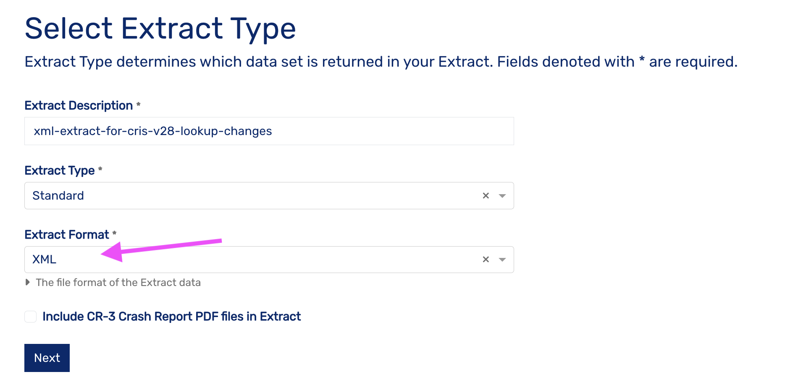
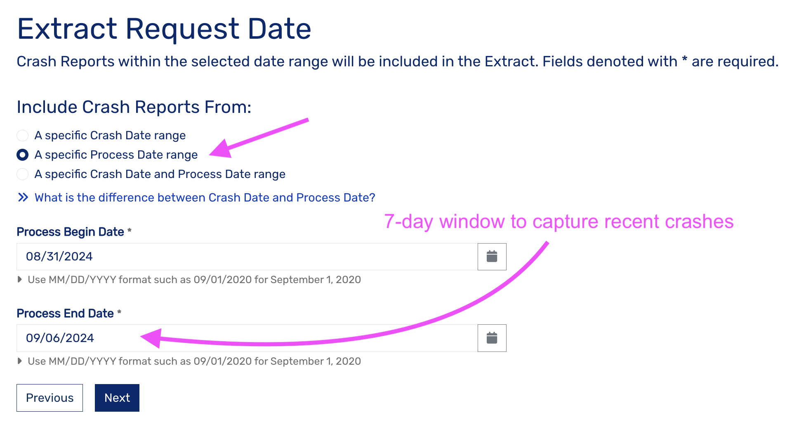

This helper is for the purpose of getting our lookup tables up to date with the latest lookup export from CRIS. It generates up and down migrations which can be applied to the database in order to bring our database back in sync with the lookup values that CRIS provides in extract files.

This tool should be run after every major CRIS release.

### Install packages

Create or activate your virtual python environment using [venv](https://docs.python.org/3/library/venv.html).

Install packages from the requirements.txt file:

```shell
$ pip install -r requirements.txt
```

### Env file

The script requires access to our graphql endpoints via the following environment vairables:

```shell
HASURA_GRAPHQL_ENDPOINT=http://localhost:8084/v1/graphql
HASURA_GRAPHQL_ADMIN_SECRET=hasurapassword
```

The above variables are used by default and require zero configuration if running locally. Otherwise, you will need to modify and export these variables into your Python environment before running the script.

### CRIS lookup values XML

The script relies on the lookup values file provided in a CRIS extract in XML format. To obtain the latest copy of this file, you will need to login in to the CRIS system and request an extract in XML format. When requesting the extract, you should request the extract based on crash process date covering the last seven days.

Remember to login to CRIS using our account labeled "(dev/testing extract account)" in our password store. Do not use our production login for this task, because you risk breaking our daily production extract delivery.

The below screenshots show the CRIS extract configuration page at the time of writing:

 

 



Once the extract has been delivered, unzip it and, locate the lookup XML file, and save it as `./cris_data/lookups.xml` within this toolbox directory.

Note that the extract may contain multiple lookup files depending on the date range of crashes in your extract. Make sure to use the lookup file with the most recent year in the timestamp.


### Run the script

1. Start your local instance with a fresh replica of the production database. 
   
2. Run the script. The output migration files will be saves to `./migrations`.

```shell
$ python get_lookup_table_changes.py
```

3. To test the migrations, navigate to `./atd-vzd` and create a new migration with the Hasura console.

```shell
$ hasura migrate create lookup_table_migrations_cris_v28
```

4. Copy the `up` and `down` migrations that the script generated into the new migration folder, and apply them.

```shell
hasura migrate apply
```

In some cases, the migrations applied by this helper may fail to due to conflicts with historical records. In those cases, you will need to manually create/edit the migrations and use your best judegment as to how to approach the change. PR [#1541](https://github.com/cityofaustin/atd-vz-data/pull/1541) covers an example of this scenario.

1. Finally, re-apply metadata to check for errors. 

```shell
hasura metadata apply
```
