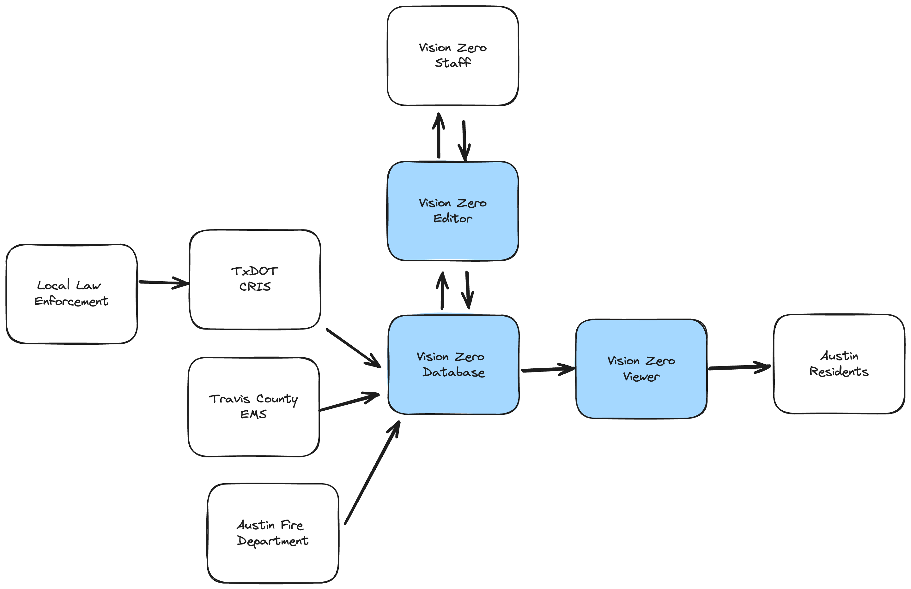
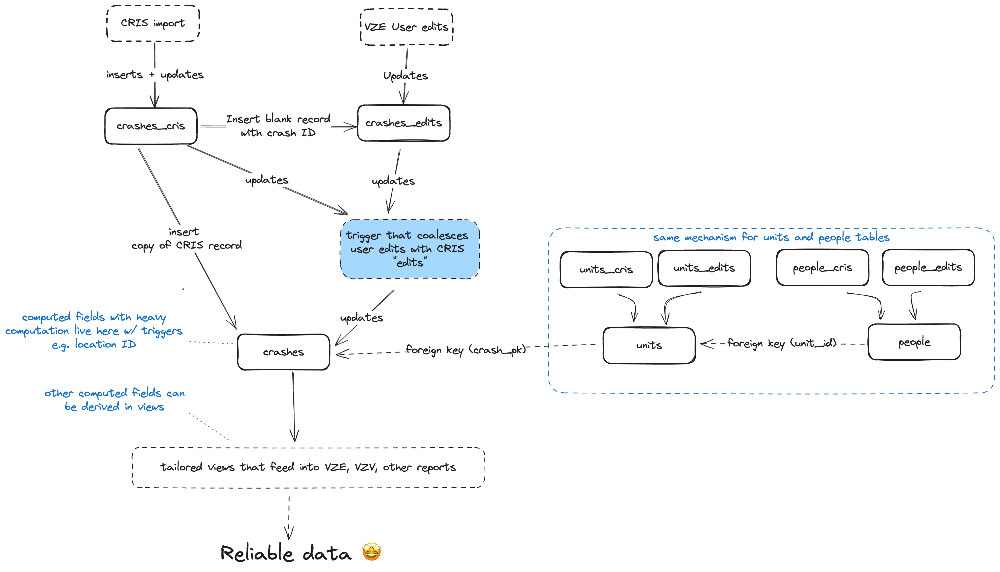

# Vision Zero Database (VZD)

The Vision Zero Database (VZD) is a Postgresql database that serves as the central repository Austin's traffic crash data. The database is fronted with a GraphQL API, powered by [Hasura](https://github.com/hasura/graphql-engine), which is also used to manage schema migrations.

The designed supports a sophisticated editing environment which enables Vision Zero program staff to edit and enrich crash data, while also allowing record updates to flow into the database from upstream sources, such as the TxDOT Crash Information System (CRIS).



## Data sources

### TxDOT Crash Records Information System (CRIS)

The [TxDOT Crash Record Information System](https://www.txdot.gov/data-maps/crash-reports-records/crash-data-analysis-statistics.html), CRIS, is a statewide, automated database for traffic crashes reports.

CRIS data accounts for the vast majority of records in the database: the [Vision Zero Editor (VZE)](../atd-vze/README.md) is designed primarily as a tool for editing and enriching data received from CRIS, and the [Vision Zero Viewer (VZV)](../atd-vzv/README.md) is powered entirely by enriched CRIS data.

The CRIS data in our database consists of four record types:

- `crashes` - each row is single crash event, with attributes such as the crash timestamp, crash location, and manner of collision
- `units` - each row describes a unit, or vehicle, involved in a crash. Each unit relates to one crash record.
- `people` - each row describes a person involved in a crash. Each person relates to one unit.
- `charges` - each row descibes a legal charge filed by the responding law enforcement agency. Each charge relates to one person

#### Design

The core challenge that the Vision Zero database solves is to store CRIS data in a central repository where it can be reviewed and updated City of Austin staff. The database preserves the integrity of staff members' edits while simultaneously allowing crash record updates to flow into the database from CRIS.

The editing environment is achieved by managing multiple copies of each of the `crashes`, `units`, and `people` tables, so that CRIS edits and Vision Zero staff edits remain isolated.

For example, the `crashes` records are managed in three tables:

- `crashes_cris`: stores crash records that are created and updated by TxdDOT CRIS through the [CRIS import ETL](../atd-etl/cris_import/README.md)
- `crashes_edits`: stores crash record edits created by Visio Zero staff through the Vision Zero Editor web app
- `crashes`: stores a unified version of each record which combines the values in `crashes_cris` plus any values in `crashes_edits`

As pictured in the diagram below, the typical data flow for a crash record is as follows:

1. A new record is inserted into the `crashes_cris` table through the [CRIS import ETL](../atd-etl/cris_import/README.md).
2. On insert into `crashes_cris`, an "empty" copy of the record is inserted into the `crashes_edits` table. The record is inserted into the `crashes_edits` table with null values in every column except the `id`, which has a foreign key constaint referencing the `crashes_cris.id` column.
3. At the same time, a complete copy of the record is inserted into the `crashes` table.
4. A Vision Zero Editor user may update a crash records b updating rows in the the `crashes_edits` table. When an update is received, a trigger function coalesces each value in the `crashes_edits` table with the corresponding value in the `crashes_cris` table. The resulting record—which contains the original CRIS-provide values plus any edit values made through user edits—is applied as an update to corresponding record in the `crashes` table.
5. Similarly, when an existing `crashes_cris` record is updated through the CRIS import ETL, the updated record is coalseced against the corresponding row in the `crashes_edits` table, and result is saved in the `crashes` table.
6. Finally, once a record is updated in the `crashes` table, additional trigger functions apply various business rules and enrich the row with spatial attributes based on it's location. These trigger functions are reserved for values that require heavy computation—additional business rules can be applied through table views.


_The "layered" editing environment of the Vision Zero Database_

The process for updating `units` and `people` behaves in the same manner as `crashes`. 

#### "Temporary" records

#### CRIS data processing

We receive CRIS data from TxDOT on a nightly basis through the CRIS "automated interface", which delivers an encrypted `.zip` file to an S3 bucket on our AWS premise. The `.zip` file contains all crash records _process_ in the last 24 hours, and includes both CSV files and crash report PDFs (aka CR3s).

At the time of writing, [this guide](https://www.txdot.gov/content/dam/docs/crash-records/cris-guide.pdf) provides an overview of how CRIS data delivery is configured.

For more details on how we ingest CRIS data into our database, see the [CRIS import ETL documentation](../atd-etl/cris_import/README.md).

### Austin Fire Department (AFD) and Travis County Emergency Medical Services (EMS)

### Geospatial layers

## Common maintenance tasks

### Add a new CRIS-managed column to the database

### Add a custom column to the database

### Add a custom lookup value to the database

### Debugging record triggers


## Audit fields and change logs

## Backups

RDS

## Hasura

We deployed a standard Hasura container to work as an API between Postgres and atd-vze. For more information on how it works, please refer to their [website](https://hasura.io) and documentation.

## Pipeline

Changes to the schema and database are handled by CI (GitHub Action workflow) that applies migrations and metadata using the [Hasura CLI](https://hasura.io/docs/latest/hasura-cli/overview/).

### Generating migrations and metadata changes

- Merge the latest code from the `master` branch into your feature branch to make sure you have the latest migrations that are applied to the staging database
- Start up the local database and Hasura engine and replicate using the latest production data dump
- To make sure your local database is up to date with the current changes in `master` branch, run:

```bash
hasura migrate apply --envfile .env.local
hasura metadata apply --envfile .env.local
```

- Start the local Hasura console and make any changes needed which will then reflect in your project folder

### Merging an approved feature branch

We need to check the order of migrations against those in the `master` branch **before merging a feature branch** so that we can make updates to the migration version order if needed. The version refers to the timestamp in the migration folder name.

To check migrations for any conflicts with the latest migrations in the `master` branch:

- Make sure that your branch is up to date with `master`
- Check to make sure no one else is actively merging their work and coordinate if needed
- Update the migration versions in your branch so they are the newest migrations if needed
- Start up the local database and Hasura engine and replicate using the latest production data dump
- Then, run:

```bash
hasura migrate apply --envfile .env.local
hasura metadata apply --envfile .env.local
```

Once we see that no errors occur when applying the sequence of migrations locally, we can merge and the CI will apply the new migrations and metadata to the staging database.

<!-- Production site: http://vzd.austinmobility.io/ -->
<!-- Staging site: https://vzd-staging.austinmobility.io/ -->
